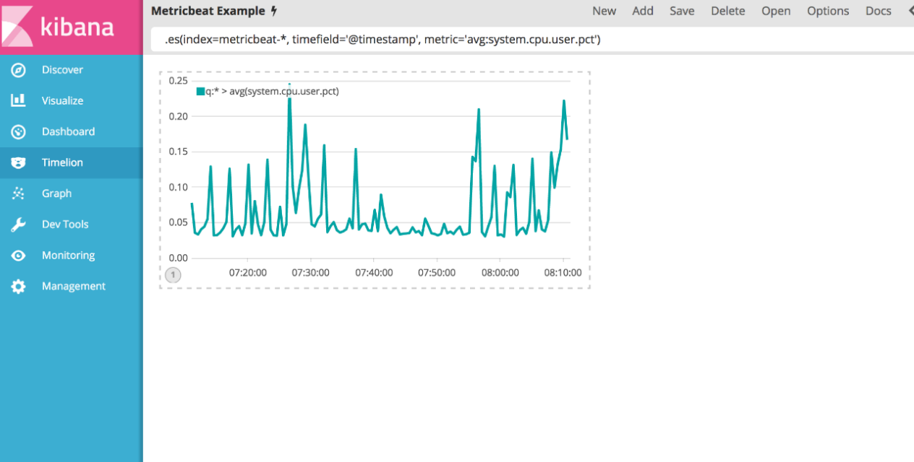

# Kibana 활용

### Aggregation&#x20;

집계(Aggregation)&#x20;

* 집계 프레임워크는 검색 쿼리를 기반으로 집계된 데이터를 제공&#x20;
* 집계는 문서 세트에 대해 분석적인 정보를 구축하는 작업 단위&#x20;
* 검색 결과에 다양한 연산 적용&#x20;
* RDBMS 의 groupby 와 유사&#x20;
* 메트릭 집계, 버킷 집계, 파이프라인 집계, 매트릭스 집계, 누적 커디널리티 집계

### Kibana 모니터링&#x20;

#### 매트릭(metric) 집계&#x20;

* 도큐먼트를 계산해서 처리된 값&#x20;
* 필드에서 숫자 타입으로 동작하며 주어진 컨텍스트(테이블)에서 숫자 필드의 집계 값을 계산하는데 사용
* SQL의 "SELECT avg(score) FROM results"와 비슷
* 사용계산식은 합계, 평균값,최소값, 최대값등
* Metric집계는 내부에서 다른 집계 타입과는 중첩해 사용할 수 없음
* 타입 리스트 : Avg Aggregation, Cardinality Aggregation, Extended Stats Aggregation, Geo Bounds Aggregation, Geo Centroid Aggregation, Max Aggregation, Min Aggregation, Percentiles Aggregation, Percentile Ranks Aggregation, Scripted Metric Aggregation, Stats Aggregation, Sum Aggregation, Top hits Aggregation, Value Count Aggregation
* Stats 집계 : 단일 요청에서 Document

#### 매트릭(metric) 집계 구조&#x20;

```json
GET /{index_name}/_search?pretty { 
    "size": 0, 
    "aggs": { // 집계 
        "my_aggs": { // 집계 명 (사용자 정의) 
            "{metric_arrgs_type}": { // 집계 타입 
                "field": "{file_name}" // 집계 대상 필드 
                "order" : { 
                    "{field_name}" : "desc" 
                } // 정렬 
            }…
```

#### 버킷(bucket) 집계&#x20;

* 조건에 해당하는 도큐먼트를 버킷이라는 저장소 단위로 구분해 담아 새로운 집합을 생성&#x20;
* 타입 리스트 : Children Aggregation, Date Histogram Aggregation, Date Range Aggregation, Filter Aggregation, Filters Aggregation, Geo Distance Aggregation, GeoHash grid Aggregation, Global Aggregation, Histogram Aggregation, IPv4 Range Aggregation, Missing Aggregation, Nested Aggregation, Range Aggregation, Reverse nested Aggregation, Sampler Aggregation, Significant Terms Aggregation, Terms Aggregation

#### 버킷(bucket) 집계 구조&#x20;

```json
GET /{index_name}/_search?pretty { 
    "size": 0, 
    "aggs": { // 집계 
        "my_aggs": { // 집계 명 (사용자 정의) 
            "{bucket_arrgs_type}": { // 집계 타입 
                "field": "{file_name}" // 집계 대상 필드 
                "order" : { 
                    "{field_name}" : "desc" 
                } // 정렬 
            } …
```

#### 파이프라인(pipeline) 집계&#x20;

* 집계의 결과를 다른 집계에 활용&#x20;
* 레벨에 따라 부모/자식 집계로 나뉨&#x20;
* buckets\_path 지정 필수&#x20;
* 타입 리스트 : Avg Bucket Aggregation, Derivative Aggregation, Max Bucket Aggregation, Min Bucket Aggregation, Sum Bucket Aggregation, Stats Bucket Aggregation, Extended Stats Bucket Aggregation, Percentiles Bucket Aggregation, Moving Average Aggregation, Cumulative Sum Aggregation, Bucket Script Aggregation, Bucket Selector Aggregation, Serial Differencing Aggregation&#x20;

#### 파이프라인(pipeline) 집계 구조 1&#x20;

```json
GET /hotels/_search?pretty { 
    "size": 0, 
    "aggs": { 
        "{parent_aggs_name}": { // 부모 집계 이름 (사용자 정의)
            "{bucket_type_name}": { // 버킷 집계 타입 이름 
                "field": "{field_name}" // 버킷 집계 대상 필드
            },
```

#### 파이프라인(pipeline) 집계 구조 2&#x20;

```json
GET /hotels/_search?pretty 
    "aggs": { 
        "{aggs_name}": { // 집계 이름 (사용자 정의) 
            "{metric_aggs_type}": { // 매트릭 집계 타입 
                "field": "{field_name}" // 매트릭 집계 대상 필드 
            } …, 
            "{pipe_arrgs_name}": { // 파이프라인 집계 이름(사용자정의) 
                "{pipe_arrgs_type}": { // 파이프라인 집계 타입 
                    "buckets_path": "{parent_aggs_name} >{aggs_name}" // 경로
                } …
```

### Time Lion

시계열 데이터 분석기 Timelion

* 서로 다른 데이터를(서로 다른 Index Pattern) 결합하여 하나의 시계열에서 시각화 할 수 있는 도구
* 완전히 독립적인 데이터 소스를 데이터 검색, 시계열 조합, 변환 및 시각화를 결합하는 간단한 1행 표현식 언어로 구동되는 단일 인터페이스로 통합
* timelion은 시계열 데이터 분석에 특화되어 있으며, 함수 형식의 표현식을 사용하고 자동완성을 지원&#x20;
* 모든 Timelion 표현식은 데이터 소스 함수(예를 들어, .elasticsearch(_) 또는 줄여서 .es(_) 로 시작됨

Metricbeat 시계열 데이터

<figure><figcaption></figcaption></figure>

대시보드에 추가

<figure><figcaption></figcaption></figure>

### Dev Tools

#### RESTFul 시스템

*

    Elasticsearch는 http 프로토콜로 접근이 가능한 REST API를 지원
* Kibana에서 elasticsearch 의 REST API를 호출할 수 있는 편리한 UI 툴
* 자원별로 고유 URL로 접근이 가능하며 http 메서드 PUT, POST, GET, DELETE 를 이용해서 자원을 처리&#x20;
* RESTFul 시스템에서의 데이터 처리
  * 입력 : PUT http://user.com/kim -d {"name":"kim", "age":38, "gender":"m"}
  * 조회 : GET http://user.com/kim
  * 삭제 : DELETE http://user.com/kim

#### Console

* Kibana에서 Elasticsearch 의 REST API 사용 가능

<figure><figcaption></figcaption></figure>

#### Search Profiler

* Kibana에 install X-Pack하면 Search Profiler가 자동으로 활성화

<figure><figcaption></figcaption></figure>
